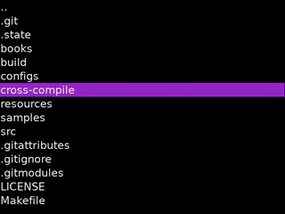

## [Pixel Reader](https://github.com/ealang/pixel-reader)

An ebook reader app for the Miyoo Mini. Supports epub and txt formats.



## Fork changes

This is a personal fork with a CPU/battery pass and several new features on
top of upstream, all reachable from the in-app Settings menu (press X) unless
noted otherwise:

- **Lower idle CPU/battery use**: the main loop now sleeps on real input
  events instead of polling at a fixed 20Hz forever, so the device should stay
  cooler and last longer with a book open and idle.
- **Screen rotation**: 0/90/180/270 degrees, takes effect immediately.
- **Custom colors**: a 5th "Custom" theme with user-editable background and
  foreground colors (6 rows to step each RGB channel).
- **Battery %**: shown top-right when running on Miyoo Mini/Mini+ hardware
  (reads `/tmp/battery`, already kept up to date by OnionOS/MiniUI). Run
  `sandbox battery` to check this works on your specific firmware.
- **Folder styling**: folders in the book list render with a trailing `/`
  and in a secondary color so they stand out from files.
- **Per-book read %**: files you've started show how far you got, without
  needing to reopen them.
- **Gallery/cover view**: a grid view with epub cover thumbnails, alongside
  the original list view - toggle with the "Browse view" setting (takes
  effect the next time you launch the app).
- **Auto-scroll**: press Y while reading to start a smooth, pixel-by-pixel
  auto-scroll; hold L2/R2 to adjust its speed; any D-pad press or Y again
  stops it.

None of this has been run on real Miyoo Mini/Mini+ hardware yet - see the
"Open items to confirm on real hardware" notes in the commit history for the
couple of things (exact battery file path, rotation direction) that are
easiest to get backwards without a device to test on.

## Miyoo Mini Installation

Supports Onion, MiniUI, and the default/factory OS.

1. [Download the latest release](https://github.com/ealang/pixel-reader/releases). Make sure to get the correct zip file for your OS. For Onion or default/factory OS: `pixel_reader_onion_xxx.zip`. For MiniUI: `pixel_reader_miniui_xxx.zip`. 
2. Extract the zip into the root of your SD card.
3. Boot your device, and the app should now show up in the apps/tools list.

The default location for book files is `Media/Books`.

## Development Reference

### Desktop Build

Install dependencies (Ubuntu):
```
apt install make g++ libxml2-dev libzip-dev libsdl1.2-dev libsdl-ttf2.0-dev libsdl-image1.2-dev
```

Build:
```
make -j
```

Find app in `build/reader`.

### Miyoo Mini Cross-Compile

Cross-compile env is provided by [shauninman/union-miyoomini-toolchain](https://github.com/shauninman/union-miyoomini-toolchain). Docker is required.

Fetch git submodules:
```
git submodule init && git submodule update
```

Start shell:
```
make miyoo-mini-shell
```

Create app packages:
```
./cross-compile/miyoo-mini/create_packages.sh <version num>
```

### Run Tests

[Install gtest](https://github.com/google/googletest/blob/main/googletest/README.md).

```
make test
```
